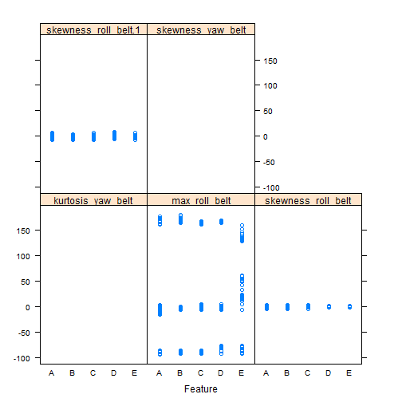

#Introduction

This report is for the Coursera Practical Machine Learning Project.The goal of this project is to predict how a subject is performing a task from a set  of measurements.
With the advances in wearable devices that record data about the activities a person engages in,it becomes possible to use these devices to monitor the elderly,the disabled and the sick.

In this project the data is from  http://groupware.les.inf.puc-rio.br/har. we want to train our data on the training data and apply the resulting machine learning method on the testing data.

##Data processing


```r
library(caret)
```

```
## Warning: package 'caret' was built under R version 3.0.3
```

```
## Loading required package: lattice
```

```
## Warning: package 'lattice' was built under R version 3.0.3
```

```
## Loading required package: ggplot2
```

```r
library(plyr)
```

First we read in the data contained in the training and testing folders.

```r
##read the training and testing files into two separate files.
pml_train <- read.csv("pml-training.csv",na.strings=c("#DIV/0!","NA"))
pml_test <- read.csv("pml-testing.csv",na.strings=c("#DIV/0!","NA"))
```
Next we impute the missing values with the mean of the feature.


```r
for (i in which(sapply(pml_train, is.numeric))) {
    pml_train[is.na(pml_train[, i]), i] <- mean(pml_train[, i],  na.rm = TRUE)
}
for (i in which(sapply(pml_test, is.numeric))) {
    pml_test[is.na(pml_test[, i]), i] <- mean(pml_test[, i],  na.rm = TRUE)
}
```

##Exploratory Data Analysis

Representative plots of the features vs the activity are shown below.


```r
featurePlot(x=pml_train[,14:18],y=pml_train$classe)
```

 

##Data Transformation and feature selection

In order to get a better handle of the analysis we would like to reduce the features and select those most relevant.

First all the features with zero or near zero variance were identified and removed.

Secondly those features denoting times of exercise,participant's name,or serial numbers given to participants were removed.


```r
#remove the features with zero and near zero variances
nzv <- nearZeroVar(pml_train)
filtered_pml_train <- pml_train[,-nzv]
nzv1 <- nearZeroVar(pml_test)
filtered_pml_test <- pml_test[,-nzv]
#remove the features indicating participant names,times
#of exercise.
filtered_pml_train <- filtered_pml_train[,-c(1,2,3,4,5,6,7)]
filtered_pml_test <- filtered_pml_test[,-c(1,2,3,4,5,6,7)]
```

These operations provided a clean dataset on which the training of the data was conducted.


##Training the data

The Caret library was used for the training of the data.The training data was split into a 70:30 training and testing sets.The testing set was used to cross validate
the prediction model.The primary goal of this project is to build a model that predicts the class of the activity as one of five classes A-E.
Since this is a classification problem I chose a tree based method the Generalized Boosting Model(gbm).


```r
set.seed(1217)
Intrain <- createDataPartition(filtered_pml_train$classe,p=0.7,list=FALSE)
filtTrain <- filtered_pml_train[Intrain,]
filtTest <- filtered_pml_train[-Intrain,]
fitControl <- trainControl(method="cv",number=5)
fit1 <- train(classe~.,data=filtTrain,method="gbm",trControl = fitControl)
```

```
## Loading required package: gbm
```

```
## Warning: package 'gbm' was built under R version 3.0.3
```

```
## Loading required package: survival
## Loading required package: splines
## 
## Attaching package: 'survival'
## 
## The following object is masked from 'package:caret':
## 
##     cluster
## 
## Loading required package: parallel
## Loaded gbm 2.1
```

```
## Warning: package 'e1071' was built under R version 3.0.3
```

```r
predictions <- predict(fit1,filtTest)
```
After the test method was developed it was applied to the cross-validation set to determine the out of sample error. 
The model developed in this project has an accuray of 
0.962 with 95% CI(0.958,0.966) and p-value of 0 and thus is statistically significant.
The predicted accuracy was borne by the result of applying the model to the 20 test cases where it correctly predicted all of them.

```r
confusionMatrix(predictions,filtTest$classe)
```

```
## Confusion Matrix and Statistics
## 
##           Reference
## Prediction    A    B    C    D    E
##          A 1637   45    1    2    3
##          B   19 1063   22    1    8
##          C   12   27  988   29    7
##          D    5    1   10  917   10
##          E    1    3    5   15 1054
## 
## Overall Statistics
##                                         
##                Accuracy : 0.962         
##                  95% CI : (0.956, 0.966)
##     No Information Rate : 0.284         
##     P-Value [Acc > NIR] : < 2e-16       
##                                         
##                   Kappa : 0.951         
##  Mcnemar's Test P-Value : 0.000101      
## 
## Statistics by Class:
## 
##                      Class: A Class: B Class: C Class: D Class: E
## Sensitivity             0.978    0.933    0.963    0.951    0.974
## Specificity             0.988    0.989    0.985    0.995    0.995
## Pos Pred Value          0.970    0.955    0.929    0.972    0.978
## Neg Pred Value          0.991    0.984    0.992    0.990    0.994
## Prevalence              0.284    0.194    0.174    0.164    0.184
## Detection Rate          0.278    0.181    0.168    0.156    0.179
## Detection Prevalence    0.287    0.189    0.181    0.160    0.183
## Balanced Accuracy       0.983    0.961    0.974    0.973    0.985
```

```r
testpredictions <- predict(fit1,filtered_pml_test)

testpredictions
```

```
##  [1] B A B A A E D B A A B C B A E E A B B B
## Levels: A B C D E
```


